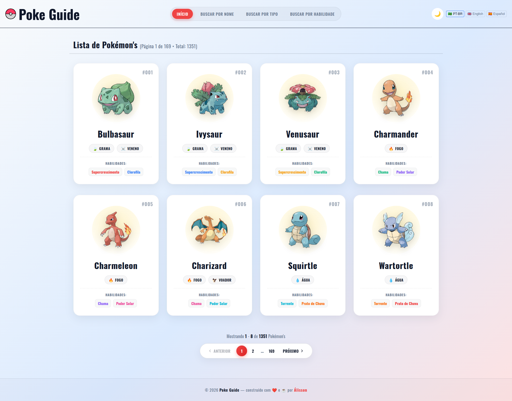
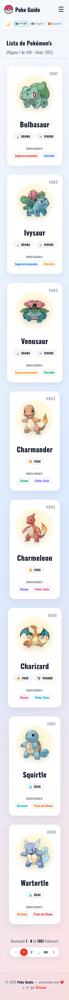
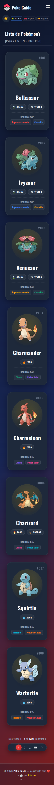

> [🇺🇲 English Version](#poke-guide----english)

> [🇧🇷 Versão em Português do Brasil](#poke-guide----português)

> [🌐 Poke Guide Web Site](https://romaosantosalisson.github.io/poke-guide/)


# Poke Guide - 🇺🇲 English

## About the Project

Poke Guide is a comprehensive web application designed to help users discover and explore information about Pokémon. It provides various search functionalities, including searching by name, type, and ability.

## Visual Demonstration

|                         Desktop (Light)                         |                        Desktop (Dark)                         |
| :-------------------------------------------------------------: | :-----------------------------------------------------------: |
|  |  |

|                         Mobile (Light)                         |                        Mobile (Dark)                         |
| :------------------------------------------------------------: | :----------------------------------------------------------: |
|  |  |

|                           Menu (Light)                            |                           Menu (Dark)                           |
| :---------------------------------------------------------------: | :-------------------------------------------------------------: |
|  |  |

## Getting Started

### Prerequisites

- Node.js (v20+)
- npm or yarn

### Installation

1. Clone the repository:
   ```bash
   git clone <repository-url>
   cd poke-guide
   ```
2. Install dependencies:
   ```bash
   npm install
   ```

### Running the Project

- To start in development mode:
  ```bash
  npm run dev
  ```
- To build for production:
  ```bash
  npm run build
  ```

---

© 2026 **Poke Guide** — built with ❤️ and ☕ by **Álisson**

---


# Poke Guide - 🇧🇷 Português

## Sobre o Projeto

Poke Guide é uma aplicação web completa projetada para ajudar usuários a descobrir e explorar informações sobre Pokémon. Ela oferece diversas funcionalidades de busca, incluindo busca por nome, tipo e habilidade.

## Demonstração Visual

|                         Desktop (Claro)                         |                        Desktop (Escuro)                         |
| :-------------------------------------------------------------: | :-------------------------------------------------------------: |
|  |  |

|                         Mobile (Claro)                         |                        Mobile (Escuro)                         |
| :------------------------------------------------------------: | :------------------------------------------------------------: |
|  |  |

|                           Menu (Claro)                            |                           Menu (Escuro)                           |
| :---------------------------------------------------------------: | :---------------------------------------------------------------: |
|  |  |

## Como Começar

### Pré-requisitos

- Node.js (v20+)
- npm ou yarn

### Instalação

1. Clone o repositório:
   ```bash
   git clone <url-do-repositorio>
   cd poke-guide
   ```
2. Instale as dependências:
   ```bash
   npm install
   ```

### Executando o Projeto

- Para iniciar em modo de desenvolvimento:
  ```bash
  npm run dev
  ```
- Para realizar o build de produção:
  ```bash
  npm run build
  ```

---

© 2026 **Poke Guide** — construído com ❤️ e ☕ por **Álisson**
