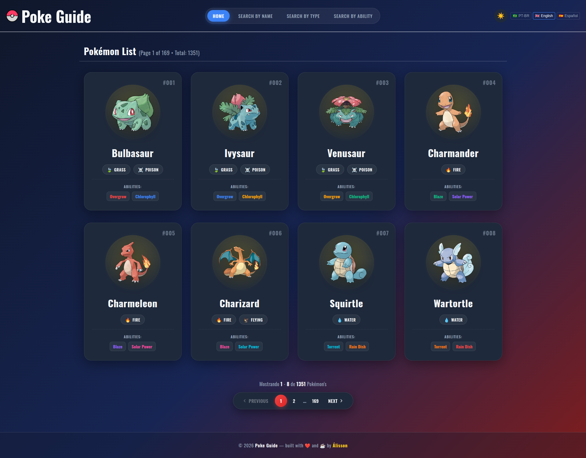

<div align="center">

  

# 🐾 Poke Guide

### Explore o mundo Pokémon de forma simples e intuitiva! ⚡

Uma aplicação web para pesquisar e explorar informações sobre Pokémon.

  <br />

[🌐 **Acessar o Poke Guide**](https://romaosantosalisson.github.io/poke-guide/)

  <br />


</div>

---

## 📖 Sobre o Projeto

**Poke Guide** é uma aplicação web desenvolvida para facilitar a descoberta e exploração de informações sobre Pokémon.

A aplicação possui diferentes formas de pesquisa, permitindo encontrar Pokémon através de **nome, tipo e habilidade**.

O projeto também conta com suporte a **internacionalização**, permitindo que a interface seja utilizada em diferentes idiomas. 🌎

---

## ✨ Funcionalidades

* 🔎 Pesquisa de Pokémon por **nome**
* 🧬 Pesquisa por **tipo**
* ⚡ Pesquisa por **habilidade**
* 🌎 Suporte a **internacionalização (i18n)**
* 📱 Interface adaptada para dispositivos móveis
* 🖥️ Interface para desktop
* 🌓 Suporte a diferentes temas visuais
* 🧭 Navegação entre páginas utilizando React Router
* 🚀 Deploy automatizado através do GitHub Actions

---

## 🖥️ Demonstração

### 💻 Desktop

|                            ☀️ Tema Claro                           |                           🌙 Tema Escuro                           |
| :----------------------------------------------------------------: | :----------------------------------------------------------------: |
|  |  |

### 📱 Mobile

|                           ☀️ Tema Claro                          |                          🌙 Tema Escuro                          |
| :--------------------------------------------------------------: | :--------------------------------------------------------------: |
|  |  |

### 🍔 Menu Mobile

|                            ☀️ Tema Claro                            |                            🌙 Tema Escuro                           |
| :-----------------------------------------------------------------: | :-----------------------------------------------------------------: |
|  |  |

---

## 🛠️ Tecnologias

O projeto foi desenvolvido utilizando:

| Tecnologia               | Descrição                                              |
| :----------------------- | :----------------------------------------------------- |
| ⚛️ **React**             | Biblioteca utilizada para construção da interface      |
| 📘 **TypeScript**        | Tipagem estática e segurança durante o desenvolvimento |
| ⚡ **Vite**               | Ferramenta utilizada para desenvolvimento e build      |
| 🧭 **React Router DOM**  | Gerenciamento das rotas da aplicação                   |
| 🌎 **i18next**           | Sistema de internacionalização                         |
| 🔤 **React i18next**     | Integração do i18next com React                        |
| 🌐 **Language Detector** | Detecção do idioma do usuário                          |
| 📡 **HTTP Backend**      | Carregamento dos arquivos de tradução                  |
| 🧹 **ESLint**            | Análise e padronização do código                       |
| ✨ **Prettier**           | Formatação automática do código                        |

---

## 📁 Estrutura do Projeto

A aplicação está organizada da seguinte maneira:

```text
poke-guide/
├── .github/
│   └── workflows/
│       └── deploy.yml
│
├── public/
│
├── src/
│   ├── assets/
│   │   └── images/
│   │
│   ├── components/
│   │
│   ├── locales/
│   │
│   ├── pages/
│   │
│   ├── types/
│   │
│   ├── utils/
│   │
│   ├── App.tsx
│   ├── index.css
│   └── main.tsx
│
├── .prettierignore
├── .prettierrc
├── eslint.config.js
├── index.html
├── package.json
├── package-lock.json
├── tsconfig.json
├── tsconfig.app.json
├── tsconfig.node.json
└── vite.config.ts
```

---

## 🚀 Como Executar

### 📋 Pré-requisitos

Antes de começar, você precisa ter instalado:

* [Node.js](https://nodejs.org/) **v20 ou superior**
* **npm**

### 📥 Instalação

Clone o repositório:

```bash
git clone https://github.com/romaosantosalisson/poke-guide.git
```

Entre na pasta:

```bash
cd poke-guide
```

Instale as dependências:

```bash
npm install
```

---

## 💻 Desenvolvimento

Para iniciar o servidor de desenvolvimento:

```bash
npm run dev
```

O Vite disponibilizará a aplicação localmente através da URL apresentada no terminal.

---

## 📦 Build

Para gerar a versão de produção:

```bash
npm run build
```

O processo de build executa a verificação do TypeScript, gera a aplicação através do Vite e prepara o `404.html` necessário para o funcionamento do roteamento no GitHub Pages.

---

## 🔎 Preview

Para visualizar localmente a build de produção:

```bash
npm run preview
```

---

## 🧹 Qualidade de Código

O projeto utiliza **ESLint** e **Prettier** para manter o código consistente e organizado.

### Verificar problemas com ESLint

```bash
npm run lint
```

### Corrigir problemas automaticamente

```bash
npm run lint:fix
```

### Formatar o projeto

```bash
npm run format
```

### Verificar formatação

```bash
npm run format:check
```

---

## 🌎 Internacionalização

O projeto utiliza **i18next** em conjunto com **React i18next** para disponibilizar a aplicação em diferentes idiomas.

As traduções são organizadas dentro de:

```text
src/locales/
```

Além disso, o projeto utiliza detecção automática do idioma do navegador através do `i18next-browser-languagedetector`.

---

## 🚀 Deploy

O projeto está hospedado no **GitHub Pages** e possui um workflow do **GitHub Actions** responsável pelo processo de deploy.

<div align="center">

### 🌐 Acesse o projeto

<a href="https://romaosantosalisson.github.io/poke-guide/">
  
</a>

</div>

---

## 🎯 Objetivo

O **Poke Guide** foi desenvolvido como uma aplicação frontend para praticar e aplicar conceitos modernos de desenvolvimento web, incluindo:

* ⚛️ Desenvolvimento com React
* 📘 TypeScript
* 🧭 Roteamento
* 🌎 Internacionalização
* 📱 Responsividade
* 🧹 Qualidade e padronização de código
* 🚀 Automação de build e deploy

---

## 🧑🏻‍💻 Autor

<div align="center">

  

### Álisson Romão Santos

Desenvolvido com ❤️, ☕ e muito código.

  <br />

  <a href="https://github.com/romaosantosalisson">
    
  </a>

</div>

---

<div align="center">

### ⭐ Gostou do projeto?

Se o **Poke Guide** foi útil ou interessante, considere deixar uma ⭐ no repositório!

  <br />

**© 2026 Poke Guide**

  <br />

*Made with ❤️ and ☕ by Álisson Romão Santos*

</div>
